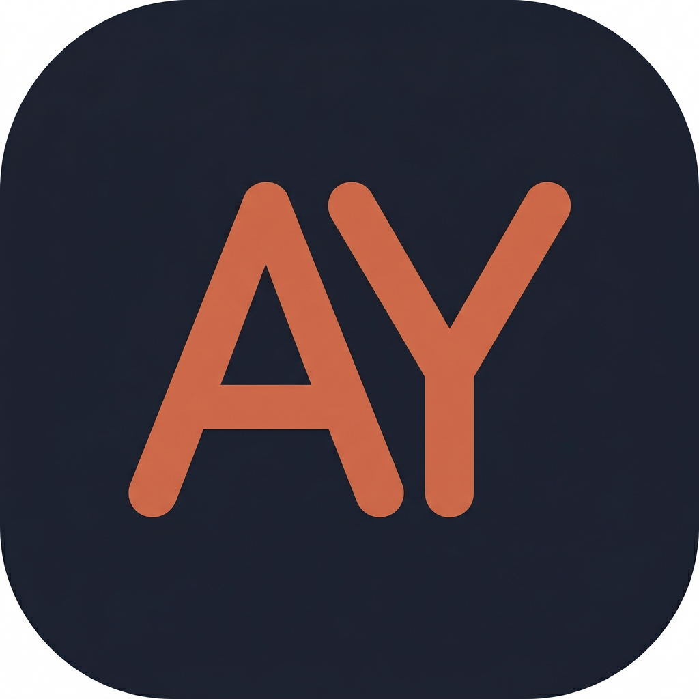

<p align="center">
  
</p>

<h1 align="center">AI-yard</h1>

<p align="center">
  <a href="https://github.com/mikulgohil/ai-yard/releases"></a>
  <a href="https://github.com/mikulgohil/ai-yard/blob/main/LICENSE"></a>
  <a href="https://github.com/mikulgohil/ai-yard/issues"></a>
  <a href="https://github.com/mikulgohil/ai-yard/pulls"></a>
  <a href="https://star-history.com/#mikulgohil/ai-yard&Date"></a>
</p>

<p align="center">
  <strong>The IDE built for AI coding agents.</strong><br/>
  Manage multiple agent sessions, run them in parallel, track costs, and never lose context — with Claude Code, Codex CLI, and Gemini CLI.
</p>

---

<p align="center">
  
</p>

<p align="center">
  
</p>

<p align="center">
  
</p>

## Why AI-yard?

Running AI coding agents in a bare terminal gets messy fast. AI-yard gives you a proper workspace — a customizable project dashboard, a kanban task board, multi-session management, split panes, swarm mode, cost tracking, and session resume — so you can focus on building, not juggling terminals.

## Highlights

- **Customizable project overview** — drag-and-drop dashboard per project with widgets for AI Readiness, Kanban, Team, Sessions, Provider Tools, and live GitHub PRs/Issues — pick what matters and arrange it your way
- **Kanban task board** — plan work on a per-project board with drag-and-drop, search, and tag filtering; each card can spawn or resume a CLI session in one click, and tasks auto-move to Done when their session completes
- **P2P session sharing** — share live terminal sessions with teammates over encrypted peer-to-peer connections (WebRTC), with read-only or read-write modes and PIN-based authentication
- **Multi-session management** — run multiple agent sessions per project, each in its own PTY; use swarm mode for a grid view of all sessions at once and spin up new ones with `Cmd+\`
- **Cost & context tracking** — real-time spend, token usage, and context window monitoring per session, plus a Cost dashboard tab with daily/weekly/monthly trends, per-provider and per-project breakdowns, and top runs across active + archived sessions
- **Session inspector** — real-time session telemetry with timeline, cost breakdown, tool usage stats, and context window monitoring (`Cmd+Shift+I`)
- **AI Readiness Score** — see how well-prepared your project is for AI-assisted coding, with one-click fixes
- **Session resume** — pick up where you left off, even after restarting the app
- **Light and dark themes** — switch the app appearance from Preferences, including live re-theming of open terminals
- **Smart alerts** — detects missing tools, context bloat, and session health issues
- **Session status indicators** — color-coded dots on each tab show real-time session state (working, waiting, input needed, completed), with optional desktop notifications
- **Embedded browser tab** — open any URL (e.g. `localhost:3000`) in a session tab, toggle element inspection to click any DOM element, and send AI editing instructions with the exact selector, text content, and page URL as context
- **Keyboard-driven** — full shortcut support, built for speed

> Supports Claude Code, OpenAI Codex CLI, and Gemini CLI. More AI CLI providers coming soon.

## Install

Requires at least one supported CLI installed and authenticated: [Claude Code](https://docs.anthropic.com/en/docs/claude-code), [OpenAI Codex CLI](https://github.com/openai/codex), or [Gemini CLI](https://github.com/google-gemini/gemini-cli).

### macOS

Download the latest `.dmg` from [GitHub Releases](https://github.com/mikulgohil/ai-yard/releases), drag to Applications, and launch. Signed and notarized by Apple.

### Linux

Download the latest `.deb` (Debian/Ubuntu) or `.AppImage` (universal) from [GitHub Releases](https://github.com/mikulgohil/ai-yard/releases).

```bash
# Debian/Ubuntu
sudo dpkg -i ai-yard_*.deb

# AppImage
chmod +x AI-yard-*.AppImage
./AI-yard-*.AppImage
```

### Windows

Download the latest Setup `.exe` (NSIS installer) or portable `.exe` from [GitHub Releases](https://github.com/mikulgohil/ai-yard/releases). Run the installer and launch AI-yard from the Start menu, or run the portable build directly.

### npm (macOS, Linux & Windows)

```bash
npm i -g @mikulgohil/ai-yard
ai-yard
```

On first run, the app is automatically downloaded and launched. No extra steps needed.

### Build from Source

```bash
git clone https://github.com/mikulgohil/ai-yard.git
cd ai-yard
npm install && npm start
```

Requires Node v24+ (see `.nvmrc`).

## Privacy

AI-yard runs locally — your projects, sessions, and transcripts never leave your machine by default. Two outbound network features are **opt-in and off by default**, both toggleable in **Preferences → General → Privacy**:

- **Send crash reports** — anonymized stack traces via Sentry. Home-directory and `~/.ai-yard` paths are scrubbed before send.
- **Send anonymous usage stats** — counters for app launch, session start (per provider), and feature use (kanban / team / browser-tab / overview). No file paths, project names, or session contents are ever sent.

See [docs/PRIVACY.md](docs/PRIVACY.md) for the exact payload shape, the device-id mechanism, and how to clear it.

## Contributing

PRs welcome! See the [Contributing Guide](CONTRIBUTING.md) and [Code of Conduct](CODE_OF_CONDUCT.md).

## License

[MIT](LICENSE)

## Credits & Acknowledgements

**AI-yard is a fork of [Vibeyard](https://github.com/elirantutia/vibeyard) by [@elirantutia](https://github.com/elirantutia).** All credit for the original architecture, design, and the bulk of the codebase goes to the upstream project. This fork exists as a personal workspace for Mikul Gohil to experiment with the codebase — extending features, exploring patterns, and learning Electron + headless-CLI integration.

The upstream MIT license is preserved in [LICENSE](LICENSE). If you find this project useful, please **star the upstream repository first**: <https://github.com/elirantutia/vibeyard>.

### Why a fork?

- **Learning playground** — a real, sizable Electron + TypeScript codebase to study and extend rather than building toy projects.
- **Personal experiments** — features and ideas that may not fit the upstream project's roadmap (tracked in [`docs/FEATURE_ROADMAP.md`](docs/FEATURE_ROADMAP.md) and [`docs/IMPROVEMENTS.md`](docs/IMPROVEMENTS.md)).
- **Public, not promotional** — published for transparency and to share back any independently-developed improvements. This is not a competing product.

### Sync with upstream

This fork tracks upstream as the `upstream` git remote. To sync:

```bash
git remote add upstream https://github.com/elirantutia/vibeyard.git  # one-time
git fetch upstream
git merge upstream/main
```

---

<p align="center">
  <a href="https://github.com/elirantutia/vibeyard"></a>
</p>

<p align="center">
  <sub>AI-yard is an independent personal fork of <a href="https://github.com/elirantutia/vibeyard">Vibeyard</a> and is not affiliated with or endorsed by Anthropic, OpenAI, Google, or the upstream Vibeyard maintainers.</sub>
</p>
